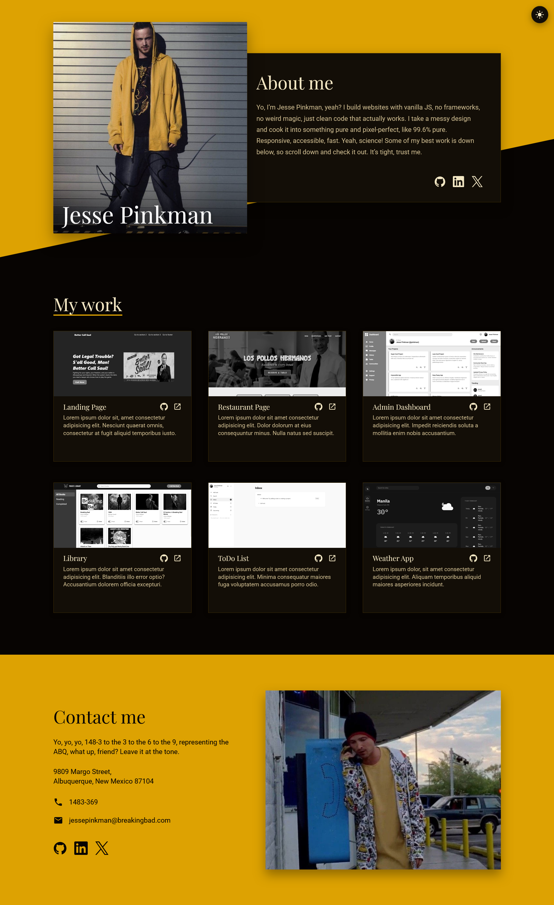

# Homepage

A personal homepage built for The Odin Project. It is built with webpack, vanilla JavaScript, and plain CSS, with no UI framework.

Live site: https://w3nc.github.io/homepage-odin/



## Features

- Light and dark theme with a toggle button. Your choice is saved to `localStorage`, and a small inline script in the document head applies it before the page paints so there is no flash of the wrong colors.
- Responsive layout with breakpoints for tablet and phone widths.
- Accessible markup: a skip link, semantic landmarks, labelled regions, `role="list"` on the project grid, `aria-label` on icon-only links, and visible focus styles.
- Six project cards, each linking to its GitHub repository and a live demo. The featured builds come from The Odin Project curriculum.
- An SVG sprite for the social and project icons, so icons are defined once and reused.
- Self-hosted fonts: Playfair Display for headings and Roboto for body text.

## Tech stack

- webpack 5, with separate development and production configs merged from a shared base
- Vanilla JavaScript using ES modules
- Plain CSS, no preprocessor
- html-webpack-plugin and html-loader to turn `src/template.html` into the built page
- mini-css-extract-plugin in production and style-loader in development
- ESLint and Prettier for linting and formatting
- webpack-dev-server for local development

## Getting started

This project is tested with Node.js 22.

```bash
npm install
```

### Local development

```bash
npm start
```
